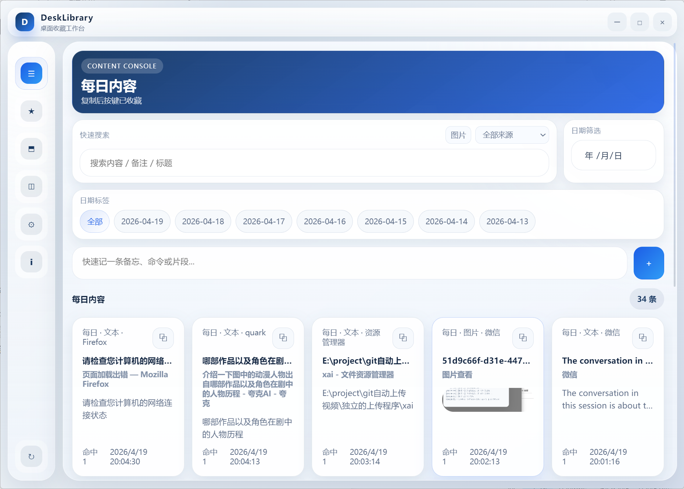
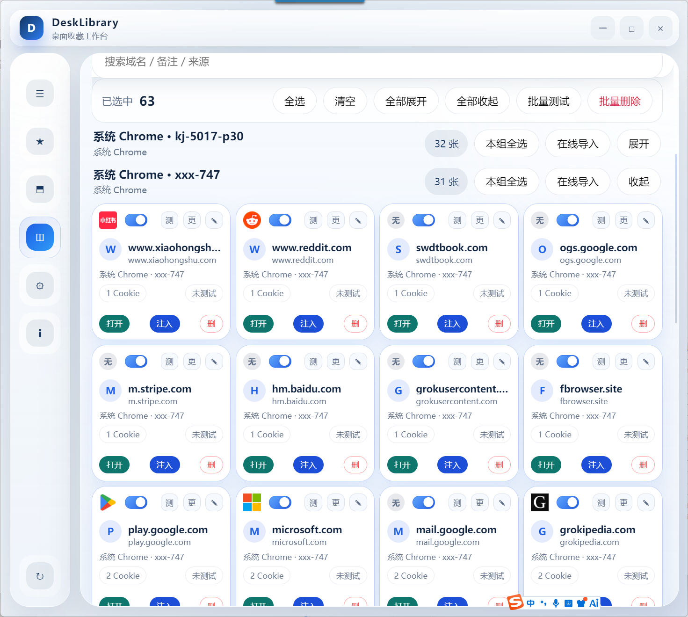
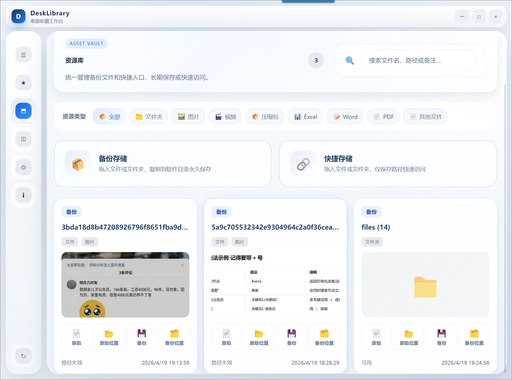
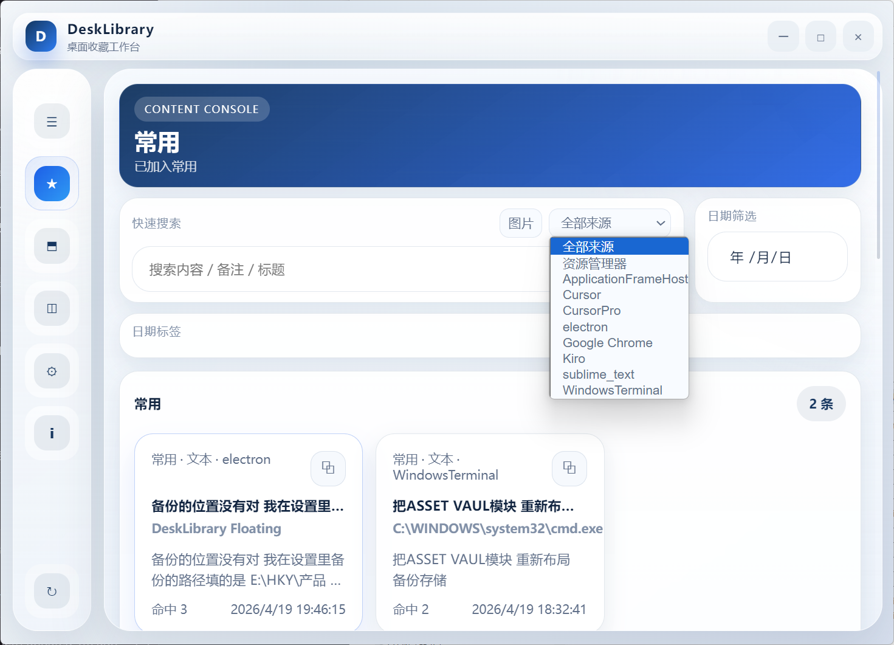
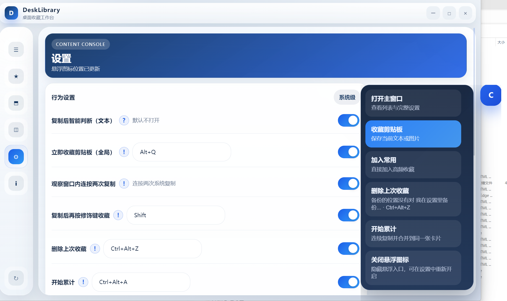
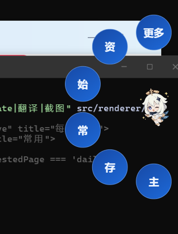

# DeskLibrary

桌面收藏工作台。  
这是一个基于 Electron 的 Windows 桌面应用，用来把零散内容集中收集、整理和再次使用。

它目前覆盖四类核心场景：

- 剪贴板收藏：文本、图片、连续复制内容的沉淀与检索
- 资源库：文件 / 文件夹的备份收藏或快捷入口管理
- 浏览器卡片：按域名管理 Cookie 卡片，支持导入、刷新、注入
- 桌面辅助能力：悬浮图标、临时便签、截图 OCR / 翻译、托盘常驻

## 界面截图

### 主界面

#### 每日内容


#### 常用内容


#### 资源库


#### 浏览器卡片


#### 设置中心


### 桌面辅助

#### 悬浮图标


#### 悬浮菜单


## 功能概览

### 1. 剪贴板收藏

- 监听剪贴板变化，保存文本和图片
- 支持多种触发策略
- 支持累计复制，将连续片段合并为一条记录
- 支持搜索、日期筛选、类型筛选
- 支持把内容移动到「常用」
- 支持多选、全选、批量删除
- 支持手动补充备注

当前内置的主要触发方式：

- 自动判断收藏
- 连按两次复制收藏
- 复制后按修饰键收藏
- 全局快捷键控制累计复制、撤销累计、删除最近一次收藏

### 2. 资源库

- 支持导入文件和文件夹
- 支持两种导入模式
- `backup`：复制一份到应用管理的备份目录
- `link`：仅保存原路径，作为快捷入口
- 支持拖拽导入
- 支持按资源类型筛选
- 支持搜索文件名、路径、备注
- 支持打开原文件、打开所在目录、打开备份文件

### 3. 浏览器卡片

- 按域名整理浏览器 Cookie
- 支持从 Chrome 用户目录读取
- 支持从自建浏览器工作目录读取
- 支持从比特浏览器 API 读取
- 支持离线导入和在线导入
- 支持刷新卡片 Cookie
- 支持把卡片 Cookie 注入到目标浏览器
- 支持连通性检测、批量删除、编辑备注 / 账号 / 密码 / 打开地址

### 4. 桌面辅助

- 悬浮图标和悬浮菜单
- 主窗口靠边停靠 / 自动隐藏
- 系统托盘驻留
- 开机启动
- 临时便签
- 截图选区
- OCR 识别
- 截图翻译

## 页面结构

当前主界面包含这些页面：

- `每日内容`
- `常用`
- `资源库`
- `浏览器卡片`
- `设置`
- `关于与反馈`

其中「关于与反馈」页支持：

- 打开项目仓库
- 填写反馈表单
- 展示联系 / 赞赏二维码资源

## 技术栈

- Electron 31
- 原生 HTML / CSS / JavaScript
- `uiohook-napi` 用于全局键盘监听
- `electron-builder` 用于 Windows 打包
- JSON 文件存储本地数据
- 部分浏览器数据处理依赖 Node / Python 辅助脚本

## 环境要求

- Windows 10 / 11
- Node.js 16 及以上
- npm

说明：

- 项目当前明显以 Windows 为主要运行平台
- 浏览器卡片、快捷键、托盘、打包等功能也都按 Windows 侧实现

## 安装依赖

```bash
npm install
```

## 开发运行

```bash
npm run dev
```

或：

```bash
npm start
```

## 打包

生成安装包：

```bash
npm run dist
```

仅生成解包目录：

```bash
npm run pack
```

产物默认输出到：

```text
release/
```

当前 Windows 图标配置位于：

- `package.json -> build.win.icon`

项目现在使用根目录下的：

```text
favicon.ico
```

## 发布新版本

项目已配置 GitHub Actions 自动发布流程，工作流文件位于：

```text
.github/workflows/release.yml
```

发布新版本时，通常按下面步骤执行：

1. 修改 `package.json` 里的版本号
2. 提交代码并推送到 `main`
3. 创建版本 tag 并推送到远端

示例：

```bash
git add .
git commit -m "release: bump version to 1.0.2"
git push origin main
git tag 1.0.2
git push origin 1.0.2
```

也支持带 `v` 前缀的 tag：

```bash
git tag v1.0.2
git push origin v1.0.2
```

推送版本 tag 后，GitHub Actions 会自动：

- 安装依赖
- 执行 `npm run dist`
- 创建或更新对应的 GitHub Release
- 上传安装包和相关产物

默认上传的文件包括：

- `release/*.exe`
- `release/*.zip`
- `release/*.blockmap`
- `release/*.yml`

## 实验性新架构分支说明

当前仓库包含一条面向后续演进的实验性分支方向。

这条分支不是单纯继续堆旧版 JSON 存储逻辑，而是在保持原有桌面软件使用方式的前提下，逐步切换到底层新的 `NextVault` 架构。

### 这条新架构分支的优势

- 数据目录对用户可见，不再完全依赖传统软件常见的隐藏式内部存储
- 数据对象结构更明确，更适合 AI 理解和执行增删改查
- 安装版 EXE 与开发版围绕同一套可控数据目录工作，便于测试、迁移、排障
- 旧 UI 继续作为产品壳使用，降低用户切换成本
- 后续更容易扩展 AI 操作能力，例如按对象进行查询、批量修改、排序、置顶、规则控制

### 它和传统桌面软件的不同点

传统桌面软件通常把数据放在较隐蔽的本地目录里，内部逻辑以“程序自己管理”为主，外部 AI 不容易直接理解和操作。

这条分支的方向不同：

- 把数据目录尽量做成用户和 AI 都能进入和理解的形式
- 让数据模型本身更适合被自然语言驱动
- 保留原有界面习惯，但逐步把底层链路改成 AI 友好的架构

一句话概括：

**旧 UI 继续用，但底层正在转向一个更适合 AI 控制的数据系统。**

### 当前状态

- 这是开发中的实验性分支
- 架构方向已经明确，但实现仍不稳定
- 目前 Bug 仍然较多
- 不建议非开发人员下载或作为稳定正式版使用

如果你只是普通用户，建议等待后续更稳定的版本；如果你是开发人员，这条分支更适合用来继续验证新架构和 AI 数据控制能力。

### 这条新分支目前已经实现、且和旧项目不同的地方

- 默认数据根目录已切换到可见目录 `Documents/DeskLibrary.NextVault`
- 旧 UI 已经可以直接读取 `NextVault`，而不是只读旧版本地 JSON
- 顶部已加入 `AI 查询 NextVault` 入口，可直接按关键词检索新数据对象
- 文本记录、图片记录、资源库、浏览器卡片，已经有一套映射到 `NextVault` 的兼容层
- 常见编辑/删除动作已能直接写回 `NextVault`，而不只是写旧存储
- 悬浮菜单最近数据也已接入 `NextVault`
- 资源库 `backup` 模式已支持读取设置里的“资源备份存储路径”
- 旧项目内部已经内置 `next-vault` 运行时代码，打包后的 EXE 不再依赖旁边的开发目录

也就是说，这条分支已经不只是“文档层面的新架构设想”，而是已经把旧产品壳和新数据架构接起来了，只是还远没有到稳定版阶段。

## 项目结构

```text
Click2Save.Electron/
├── src/
│   ├── main/
│   │   ├── index.js
│   │   ├── preload.js
│   │   ├── storage.js
│   │   ├── browser-import.js
│   │   ├── browser-node-service.js
│   │   ├── browser_cards_scan.py
│   │   └── bin/
│   ├── renderer/
│   │   ├── index.html
│   │   ├── renderer.js
│   │   ├── styles.css
│   │   ├── floating-icon-v2.*
│   │   ├── floating-menu.*
│   │   ├── screenshot-select.*
│   │   ├── screenshot-result.*
│   │   └── sticky-notes.*
│   └── img/
├── favicon.ico
├── package.json
└── README.md
```

## 本地数据目录

应用数据保存在 Electron `userData` 目录下，核心文件由 `src/main/storage.js` 管理。

主要数据包括：

- `data/records.json`：收藏记录
- `data/assets.json`：资源库索引
- `data/browserCards.json`：浏览器卡片
- `data/settings.json`：设置项
- `data/temp-sticky-notes.json`：临时便签
- `data/duplicate-notices.json`：重复提醒状态
- `data/images/`：收藏图片
- `data/assets-backups/`：默认备份资源目录

常见 Windows 路径示例：

```text
C:\Users\<用户名>\AppData\Roaming\desklibrary-electron\
```

## 设置项说明

当前代码里已经落地的设置大致包括：

- 剪贴板收藏策略开关
- 复制后触发键
- 删除最近收藏快捷键
- 累计复制开始 / 结束 / 取消 / 撤销快捷键
- 临时便签开关与快捷键
- 开机启动
- 悬浮图标开关、透明度、自定义图标路径
- 主窗口 / 悬浮窗靠边停靠
- 自建浏览器工作目录
- Chrome / Chromedriver 路径
- 比特浏览器 API 地址和 Token
- 资源备份目录
- 截图 OCR Key、OCR 语言
- 截图翻译自定义 URL / Method / Headers

## 浏览器卡片说明

浏览器卡片能力是这个项目里最偏“工具链”的部分，运行前建议先确认本机环境：

- Chrome 用户目录可访问
- 如果使用自建浏览器导入，工作目录结构要符合当前扫描逻辑
- 如果使用比特浏览器在线导入，需要本地 API 可访问
- 如果使用 Cookie 注入，需要目标浏览器实例可被识别或连接

这部分逻辑主要分布在：

- `src/main/browser-import.js`
- `src/main/browser-node-service.js`
- `src/main/browser_cards_scan.py`

## 截图 OCR / 翻译说明

项目已内置截图相关页面和设置项，支持：

- 框选截图
- OCR 提取文字
- 调用翻译接口处理识别结果

默认 OCR 配置允许使用公共 demo key，但实际使用中更建议填写你自己的 OCR 服务 Key，避免限频或失败。

## 已知定位

这个项目现在更像一个面向个人工作流的 Windows 桌面工具箱，而不是通用组件库。  
README 会以“当前代码真实具备的能力”为准，不再按早期版本的描述去包装。

如果你接下来继续迭代，最容易过期的文档通常是这几块：

- 快捷键默认值
- 浏览器导入来源
- 截图 / OCR / 翻译链路
- 打包方式和图标路径

## 开发建议

- 新增功能时，同步更新 `README.md`
- 如果改了默认设置，记得核对 `src/main/storage.js`
- 如果改了打包方式，记得核对 `package.json`
- 如果改了页面结构，记得核对截图和功能说明

## 许可证

本项目当前 `package.json` 中声明为：

```text
GPL-2.0
```

如果你准备公开发布，建议再核对一次仓库里的 `LICENSE` 文件内容是否完整且与声明一致。
